<p align="center">
  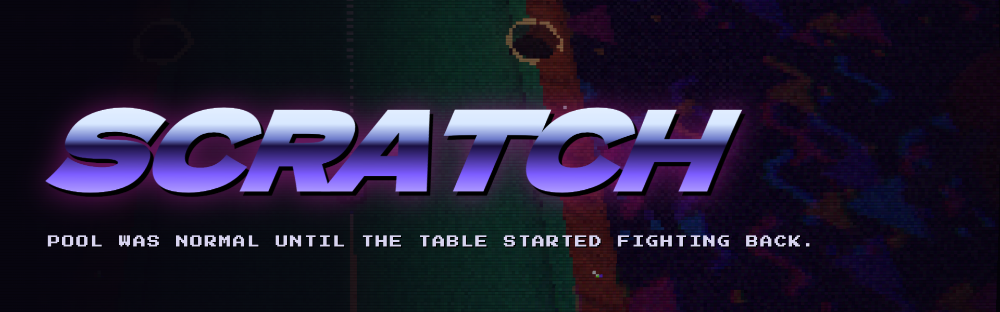
</p>

<p align="center">
  <b>A billiards roguelite from a lost 1998 disc, with a completely normal game of 8-ball hidden inside.</b><br>
  Made by <b>Paul Nercessian</b>. Now with <b>SCRATCH: AFTERHOURS</b>, the 2.0 update.
</p>

<p align="center">
  
  
  
  
  
  
</p>

<p align="center">
  <a href="https://bouwles.github.io/SCRATCH/"></a>
</p>

<p align="center">
  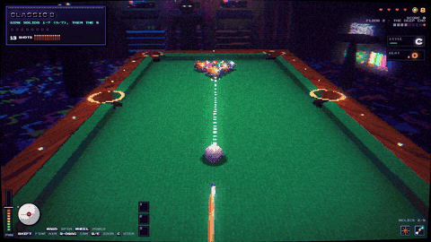
</p>

Sink balls. Pick relics that bend the rules of pool. Work your way down three
floors of increasingly strange tables and beat **The House**.

Every table, texture, icon, song and sound effect in SCRATCH is generated by
its own code as you play. The project contains no image, audio or model files.

> **New in 2.0: AFTERHOURS.** The club has moods now: Table States, Contracts,
> High Roller bets, Rivals and Nemeses, 8 new tables, Trick Tables, 3 new bosses,
> 12 hidden relic synergies, Boss Rush, One Cue, Chaos and a Classic tournament.
> Your 1.0 save carries over. The full list is in [CHANGELOG.md](CHANGELOG.md).

---

## Contents

- [Play it](#play-it)
- [Screenshots](#screenshots)
- [New in AFTERHOURS](#new-in-afterhours)
- [The roguelite](#the-roguelite)
- [SCRATCH Classic](#scratch-classic-a-normal-game-of-8-ball)
- [Controls](#controls)
- [Settings and accessibility](#settings-and-accessibility)
- [Saves](#saves)
- [Under the hood](#under-the-hood)
- [Project layout](#project-layout)
- [Credits and licences](#credits-and-licences)

## Play it

**In your browser:** go to **[bouwles.github.io/SCRATCH](https://bouwles.github.io/SCRATCH/)** and
click **PLAY**. There's nothing to install.

**From a release.** Download `SCRATCH-web-v2.1.0.zip` from the
[latest release](https://github.com/Bouwles/SCRATCH/releases/latest) and unzip it.
Serve the folder with any static server, then open `http://localhost:8000`:

```bash
python3 -m http.server 8000
```

Opening `index.html` straight from the disk (`file://`) won't work, because
browsers block ES modules there.

**From source** (Node 20.19+ or 22.12+):

```bash
git clone https://github.com/Bouwles/SCRATCH.git
cd SCRATCH
npm install
npm run dev        # http://localhost:5173
```

| Command | What it does |
| --- | --- |
| `npm run dev` | Development server with hot reload. Add `?debug` to the URL for the test hooks. |
| `npm run build` | Production build in `dist/`, with relative paths throughout |
| `npm run release` | Builds and checks the release, then packs `release/itch/SCRATCH-web-v2.1.0.zip` |
| `npm run site` | Builds the GitHub Pages site in `_site/`: the landing page, with the game in `play/` |
| `npm run test:physics` | Runs the physics edge-case suite in Node (breaks, jaws, frozen balls, obstacles, 300 random layouts) |
| `npm run check:tricks` | Plays every Trick Table with the real physics to prove each one can be solved |

Every push to `main` rebuilds and deploys the site through GitHub Actions
(`.github/workflows/deploy.yml`).

It needs a current Chrome, Edge, Firefox or Safari with WebGL 2, and a mouse.

## Screenshots

| | |
| --- | --- |
| 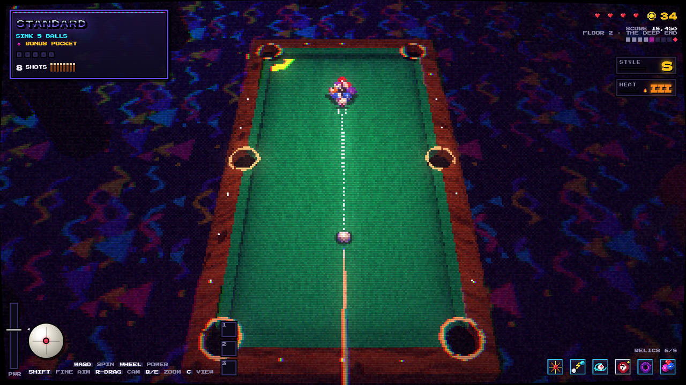 | 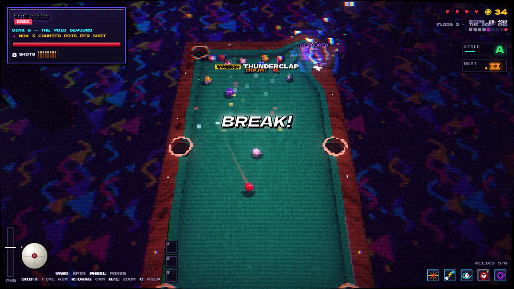 |
| 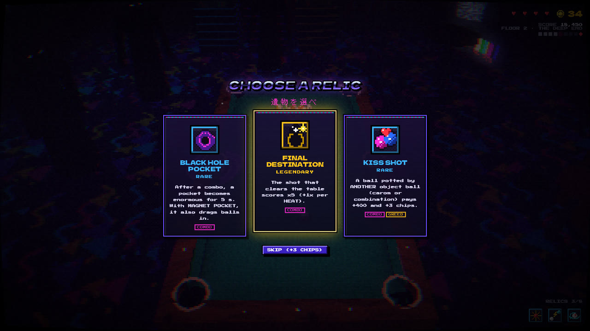 | 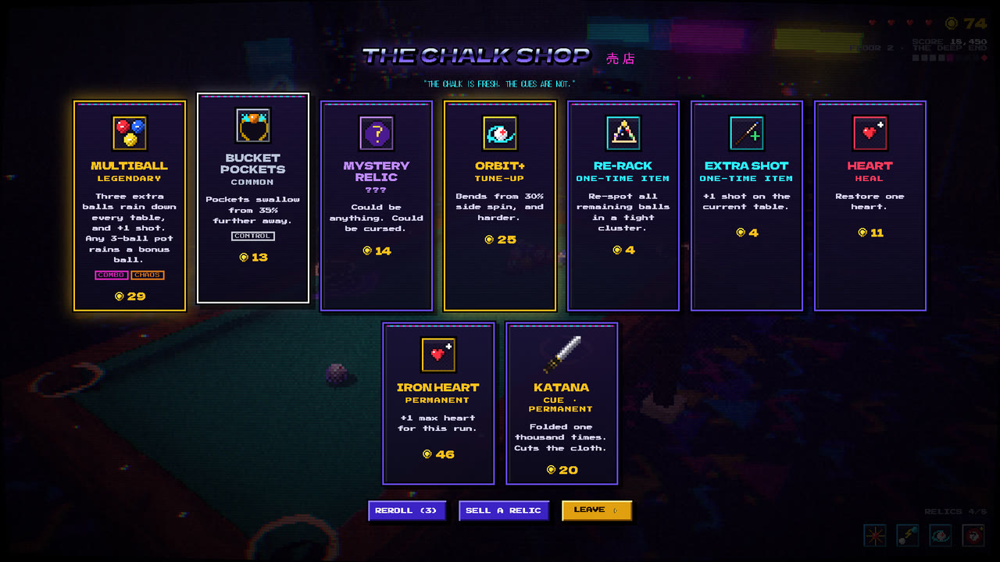 |
| 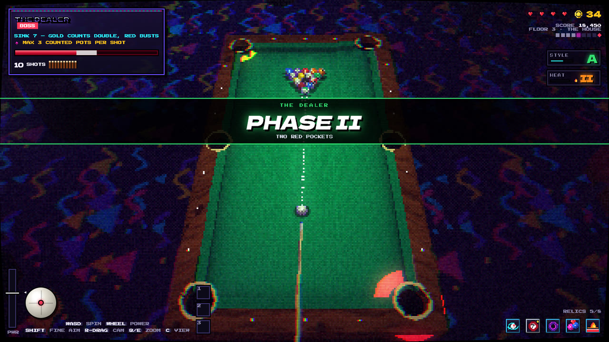 | 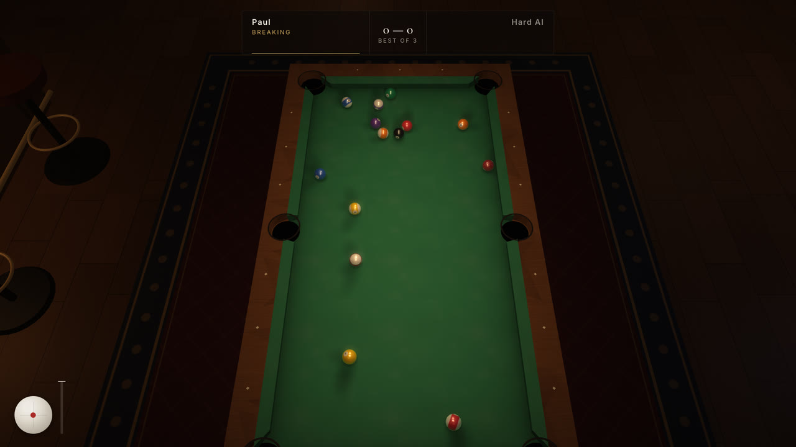 |
| 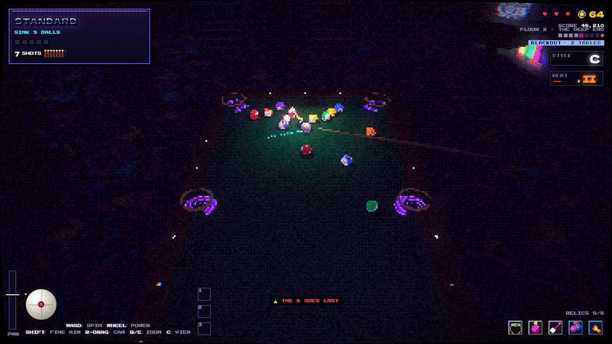 | 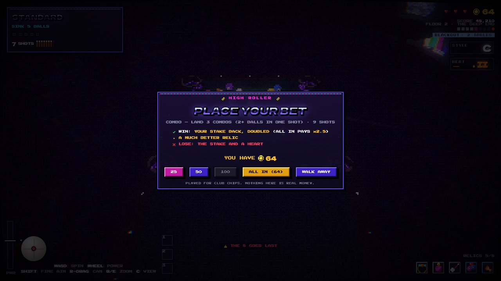 |
| 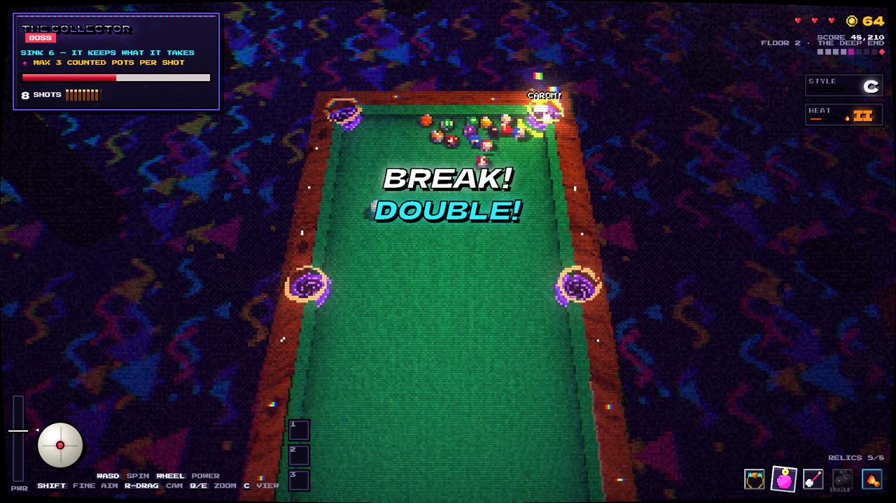 | 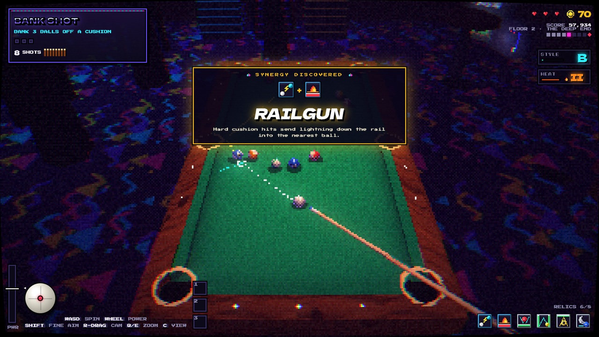 |
| 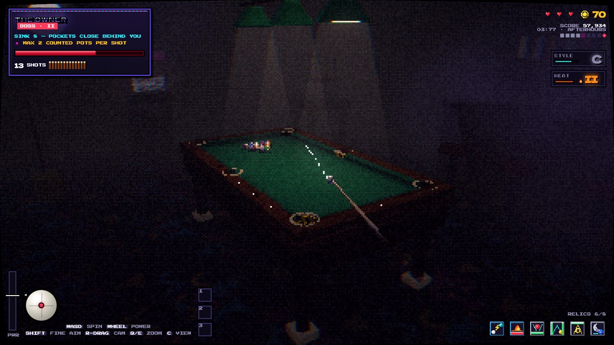 | 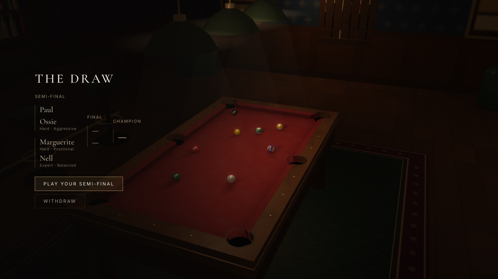 |

<p align="center">
  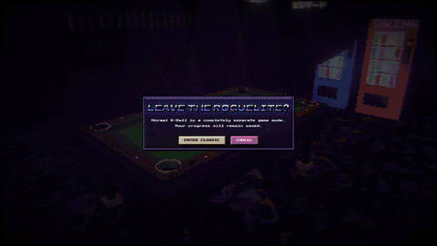<br>
  <sub>Switching to SCRATCH Classic: the tape drags, the CRT clicks off, and a quiet lounge fades in.</sub>
</p>

## New in 2.1

- **You always know what a table wants.**
  - A large bar at the bottom of the screen shows the objective in plain words
    ("POT 3 BANK SHOTS"), your progress ("1 / 3 COMPLETE") and your shots left.
  - Every table opens with its objective.
  - Every shot is explained just above the bar ("STRAIGHT POT · NO CUSHION · DOES
    NOT COUNT").
  - Every table ends with a reason.
- **SCRATCH Classic is a complete game of pool:**
  - ten regulars with portraits, five playing styles and a record against you;
  - Quick and Custom matches, best-of and race-to formats;
  - shot recognition, Break & Run, and six practice challenges;
  - a Tournament Hall, a cue-view camera and a Classic level.
- **Every cosmetic has been rebuilt** around one rule: you can always tell the cue
  ball, the 8, solids and stripes apart.
  - 15 ball sets, 9 of them animated in the shader.
  - 20 cues.
  - Felts, shot trails and pocket effects as their own slots.
  - A new Loadout screen with a live preview.

## New in AFTERHOURS

The first big update adds more to every part of a run.

- **Table States:** the club can go into one of 8 states for several tables at
  a time:
  - **Blackout** cuts the power, and the balls glow.
  - **Overtime** gives fewer shots, but multi-pots buy them back.
  - **Jackpot** fills the table with gold and puts shop prices up.
  - **Static** makes relics surge and short out.
  - **Low Gravity** means nothing wants to stop.
  - **Redline** stops HEAT from cooling.
  - **Quiet Hours** silences the crowd, and precise shots pay extra STYLE.
  - **House Rules** puts one more rule on every table, for bigger purses.
- **Contracts:** sign one of two challenges that run over several tables. The
  rewards include legendary relics, an extra relic slot and a shop discount.
- **High Roller tables:** bet 25, 50, 100 or everything you have on a harder
  table, and win it back doubled. The chips are the game's own; no real money
  is involved.
- **Rivals:** six regulars race you to the goal, taking a turn after every one
  of yours. Lose to the same one twice and they become your **Nemesis**.
- **8 new table types:** Sequence, Territory, Bounty, Escalation, Hot Potato,
  Lockdown, Perfect Route and Chain.
- **Trick Tables:** 6 hand-built puzzles with three attempts, no clock and no
  heart at risk. Each one is proven solvable against the real physics.
- **3 new bosses:**
  - **The Collector** borrows your relics.
  - **The Architect** builds walls across the felt.
  - **The Bookie** offers a side bet before every shot.

  A boss you've beaten three times may come back as a **Remix**.
- **Relics:**
  - **12 hidden synergies** stay unlisted until you discover them.
  - **5 risk relics**: Double Edge, Debt, Blind Faith, Final Form and Last Life.
  - **Overcharge** supercharges one relic until the next boss falls.
  - Once you hold four relics, your build gets a **name**.
- **Presentation:**
  - Big moments scorch and crack the felt, shake dust from the ceiling and make
    the lights flicker.
  - The crowd reads the table.
  - Optional text commentary reacts to your shots.
  - **Shot of the Run** replays your best shot at the end.
- **Modes and progress:**
  - **Boss Rush**, **One Cue** and **Chaos**.
  - **Handicaps** that multiply your rewards.
  - Expanded **Records**, a **Run History** of your last 10 builds, and
    **Favourite** relics.
- **SCRATCH Classic:**
  - **AI styles** that are separate from difficulty.
  - A four-player **tournament**.
  - A **shot clock** and **best of 7** matches.
  - Three rooms, three new felts and two new cues.

New content opens up as you play (your first runs are the 1.0 game), and your
1.0 save carries straight over.

Some runs don't end when The House falls. ...and there are several things we
aren't going to tell you about.

## The roguelite

### A run
Three floors: **The Basement**, **The Deep End** and **The House**. Each floor is
nine stops long:
- tables;
- a fork in the road (event or mystery);
- a shop;
- an elite table;
- a second fork (shop or back room);
- a boss.

**How tables work:**
- **Clearing a table** pays chips and offers one of three relics.
- **Failing a table** costs a heart and the run moves on. Bosses must be
  beaten, so a lost boss is replayed.
- **The 8 goes last.** Sinking it early costs shots. Sinking it with the winning
  pot doubles that shot.

The first runs are forgiving. Your first three standard runs start with a fourth
heart (until your first win), and short tips explain each new thing once.

### Modes
- **New Run.** Winning unlocks **BREAK** levels 1 to 5, one at a time, and each
  level keeps everything below it:
  - BREAK 1: tables ask for one more ball.
  - BREAK 2: rules, bets and High Stakes tables come earlier and more often.
  - BREAK 3: shops charge 25 % more.
  - BREAK 4: every boss uses its extra mechanic.
  - BREAK 5: heat builds 50 % faster.
- **Daily Scratch.** The same seeded run for everyone on a given date, starting
  with a choice of three relics. Your best daily score is kept.
- **Endless.** Unlocked by winning a run. The stairs keep going down past The
  House, and your deepest floor is recorded.
- **Modes** (open up as you win): **Boss Rush** plays every boss back to back.
  **One Cue** has no shot limit and five lives, and every miss costs one.
  **Chaos** starts you with three random relics at HEAT III and a Table State
  at every turn.
- **Handicaps:** six optional rules, such as Double Speed or Cursed Only, that
  multiply score and purses for a New Run or Endless.

### Content
- **19 table types:**
  - Standard
  - Combo: every pot makes its pocket hungry
  - Precision
  - Blitz
  - Trick Shot
  - Bank Shot
  - Golden Ball
  - Survival
  - Chaos
  - Assassin
  - Classic 8
  - Sequence
  - Territory
  - Bounty
  - Escalation
  - Hot Potato
  - Lockdown
  - Perfect Route
  - Chain

  There are also Rival tables, Trick Tables and High Roller tables.
- **9 bosses, each with three escalating phases:**
  - **The Crooked Table** tilts.
  - **The Mimic** shuffles its pockets, and one of them spits.
  - **The Void** is a pocket that eats shots.
  - **The Dealer** deals a gold pocket that counts double and red pockets that bust.
  - **The Clock** takes your shot for you when time runs out.
  - **The Collector** borrows your relics.
  - **The Architect** builds walls.
  - **The Bookie** takes side bets.
  - **The House** plays back against you.
- **50 relics** (17 common, 15 rare, 11 cursed including 5 risk relics, 7 legendary):
  - They are tagged by build: BANK, CHAOS, CONTROL, GREED, CURSED and COMBO.
  - Picking one you already own upgrades 24 of them to NAME+.
  - You hold up to 8.
  - Bosses count only a few pots per shot, so no build can one-shot them.
- **18 table rules** such as Moon Gravity, Tight Pockets, Bonus Pocket or
  Dangerous 8. A table gets one or two, never a pile.
- **High Stakes tables** (8 kinds) set one rule you must not break, for a much
  bigger purse. **Double or Nothing** offers 10 optional bets.
- **8 Table States, 8 Contracts and 6 Rivals**, and 12 synergies you have to
  find for yourself.
- **7 anomalies**, plus at least one that isn't on this list. **29 events**
  between tables, and mystery stops that could be anything.
- **Shops:**
  - relics, a mystery relic, relic upgrades, cursed bargains that pay you to
    take them, items, hearts and cosmetics;
  - rerolls, and selling relics back.
- **Mastery:**
  - Shots are recognised: bank, kick, carom, combination, cuts and long pots.
  - **Style** (C to S+) multiplies your score.
  - **Heat** (0 to V) makes tables harder and rewards better while you dominate.
- **Progression:**
  - 56 achievements, 7 of them secret.
  - 15 ball sets (9 animated), 20 cues, 11 felts, 5 shot trails, 7 pocket
    effects and 6 club themes.
  - Every set keeps the cue ball white, the 8 dark and the stripes striped.
  - A Collection that shows undiscovered things as `???`, with Synergies,
    Records and Run History pages.

## SCRATCH Classic: a normal game of 8-ball

**PLAY NORMAL 8-BALL** (on the main menu or in the pause menu) switches reality.
The tape drags, the CRT clicks off, one clean *clack* sounds in the dark, and
you're in a quiet late-night lounge with a jazz trio playing. **RETURN TO
ROGUELITE** glitches you back, and a run in progress is waiting for you.

- **Quick Match:** pick Easy, Normal, Hard or Expert and play the next
  regular.
- **Custom Match:** choose the opponent, difficulty, style, format (single frame,
  best of 3 or 5, race to 3 or 5), aim guide, shot clock, table, room and cue.
- **Ten regulars** with portraits and a style: Safe, Aggressive, Positional,
  Trickster or Pressure. Difficulty is how well they play; style is how they
  think.
- **The AI** plans on a private copy of the same physics and plays the real table
  with human-like error in aim, pace and spin. It lines up, takes practice
  strokes and plays safe when it should. It never moves balls or bends the
  physics.
- **Shot recognition:** bank, double bank, combination, carom, long pot, break
  pot, good position and good safety.
- **Break & Run** is recognised and rewarded.
- **Tournament:** a four-player bracket against three regulars, for a trophy.
- **Local Versus** for two players on one mouse.
- **Practice:** free practice with drills and undo, plus six challenges with
  best scores:
  - Break (spread, pots and scratch, with an instant rerack);
  - Bank;
  - Long Pot;
  - Positioning;
  - Clearance;
  - Safety.
- **Standard 8-ball rules**, with an optional **shot clock** (30, 45 or 60
  seconds). Every foul says why, and ball in hand follows.
- **Its own look, sound and settings:**
  - four rooms (Midnight Lounge, Private Club, Penthouse and Tournament Hall),
    each with its own ambience;
  - 3D, top-down and cue-view cameras, with an optional follow camera;
  - classic cosmetics only, unless you choose **All compatible**.
- **Match end** shows stats for both players, your record against that opponent
  and a one-key rematch (R).
- **Records:** win rate, streaks, Expert wins, tournaments and playtime.
- **Classic level** unlocks rooms, felts and cues, never gameplay.

## Controls

| Input | Action |
| --- | --- |
| Move the mouse | Aim (the dots show where the cue ball goes) |
| Hold / release the left button | Charge / shoot |
| Mouse wheel | Power cap |
| Right click while charging | Cancel the shot |
| Right-drag | Orbit the camera |
| Shift + mouse, or ← → | Fine aim |
| W A S D, or drag the dot on the ball | Spin |
| R | Reset spin |
| Q / E | Zoom |
| C or Tab | Cinematic 3D / top-down camera (Classic adds a cue view) |
| Hold Space | Fast-forward while balls roll |
| 1 2 3 | Use an item |
| B | Take the Bookie's side bet |
| Esc | Pause |

Menus work with the mouse or with the arrow keys, Enter and Esc.

## Settings and accessibility

| Tab | Options |
| --- | --- |
| Gameplay | Camera, aim guide Full / Reduced / Short / Off (the smaller guides pay a score bonus), camera shake 0–100 %, screen flash Full / Reduced / Off, Heat on/off, commentary on/off, reset tutorial tips |
| Graphics | **PS1** or **Modern** style, quality presets Low / Medium / High, resolution scale, CRT filter, bloom, particles |
| UI | UI scale Auto / 80–110 %, safe area, window / fullscreen, credits |
| Save | Export, import, erase |
| Audio | Master, music, effects |

- **Colour is never the only cue:**
  - The Dealer's pockets are labelled and move differently.
  - Forbidden balls get square rings and targets get round ones.
  - Rarities are written out.
- **Presets never change the physics.** It runs on a fixed 1/240 s step on
  every setting and at every frame rate.
- **The game pauses itself** when the tab loses focus. It also says so if the
  browser blocks saving.

## Saves

Everything is saved in the browser's `localStorage`. Saves are versioned (the
current format is v3) and older saves are migrated without losing anything. A
damaged save is backed up instead of crashing the game.

A run is saved at every stop and every shot, and saves can't be used to cheat:
- Closing the tab mid-table brings back the same rack, with only the shots you
  had left.
- A lost table stays lost, and a won table pays out once.
- Event outcomes are fixed by the run's seed.

**Export Save** and **Import Save** move everything to another browser as one
line of text.

## Under the hood

- **Rendering** (`src/render/`):
  - **PS1 mode** renders at about 240p with vertex snapping, affine texture
    warp, fog, and screen-door transparency. A post pass adds bloom, 15-bit
    colour with ordered dither, CRT curvature, scanlines and grain.
  - **Modern mode** switches the same materials (one shared uniform) to
    per-pixel lighting, MSAA and cube-map reflections.
- **Physics** (`src/physics/`): a custom 2D solver with 3D spin:
  - sliding and rolling friction;
  - english off the cushions;
  - follow and draw;
  - pocket jaws, per-ball radius and mass;
  - a fixed 1/240 s step.
- **Audio** (`src/audio/`): every sound and every note is synthesised with
  WebAudio. The music is a small step sequencer: trip-hop menus, jungle tables
  that change character floor by floor, dark drum-and-bass bosses, and a jazz
  trio for Classic.
- **Generation is seeded** (`src/game/rng.js`), so Daily runs and restored saves
  are fully deterministic.
- **The Classic AI** (`src/classic/ai.js`) plans with a private copy of the
  physics, spread across frames (at most 7 ms each), then plays the shot with
  execution noise tuned per level.
- **The UI** is DOM on a virtual 640×360 grid. Icons are drawn procedurally on a
  16×16 grid (`src/ui/art.js`).
- **Testing:**
  - Headless playtests drove bots through full runs, every mode and every boss
    to tune the balance.
  - `npm run test:physics` checks the solver's invariants across hundreds of
    edge cases, and `npm run check:tricks` proves every puzzle table is
    solvable.
  - Old saves were migrated and resumed mid-table.
  - It holds 60 fps with every effect stacked, in both PS1 and Modern modes.
  - Layout was checked from 960×540 to 1920×1080.

## Project layout

```
index.html              boot screen and loader
src/
  main.js               entry: fonts, WebGL check, boot
  game/                 Game loop, shots, runs, relics, encounters, events, meta progression
  classic/              SCRATCH Classic: rules, AI, lounge, UI, the reality switch
  physics/              the solver
  render/               PS1 / Modern renderer, materials, procedural textures
  world/                table, balls, cue, room, effects
  audio/                synthesis and the music sequencer
  ui/                   menus, HUD, icons
public/licenses/        third-party licence texts (shipped in the build)
scripts/release.mjs     npm run release
scripts/site.mjs        npm run site (GitHub Pages)
scripts/physics-tests.mjs   npm run test:physics
scripts/check-tricks.mjs    npm run check:tricks
site/index.html         the landing page
.github/workflows/      deploys the site to GitHub Pages
release/itch/           itch.io page copy, upload steps, cover, banners, GIFs
docs/screenshots/       screenshots for the README and the site
docs/media/             video loops for the site
```

## Credits and licences

**SCRATCH** was designed and made by **Paul Nercessian**.

It is built with [three.js](https://threejs.org) (MIT) and
[Vite](https://vite.dev) (MIT). Its typefaces are Press Start 2P, Dela Gothic
One, DotGothic16, Chakra Petch, Inter and Cormorant Garamond, all under the SIL
Open Font License. Full details are in [ATTRIBUTIONS.md](ATTRIBUTIONS.md), and
the licence texts ship with the build in `licenses/`.

© 2026 Paul Nercessian. All rights reserved. The third-party components above
keep their own licences.
